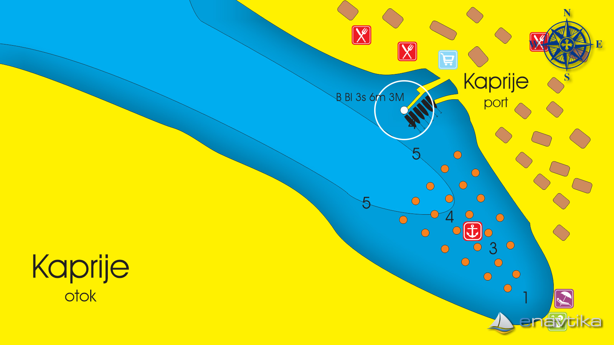

# ⛵ MarinePro

MarinePRO je spletna aplikacija za digitalizacijo marin. Vizija je, da bi aplikacijo uporabljali po vseh marinah na Jadranskem morju. Zaradi lazje predstavitve izdelka smo si izbrali marino Kaprije, za katero sem na spletu nasla podatke o stevilu in lokaciji boj, ter tudi podatek o stevilu privezov na pomolu. 

Z MarinePRO zelimo olajsati delovanje marin lastnikom in zaposlenim v marinah in tudi zmanjsati stroske. Prav tako pa bo olajsana uporaba marin tudi strankam, saj menimo, da bi s taksno aplikacijo olajsali tudi plutje po morju oz. uporabo marin.

### Primer parkiranja na boji

1. Uporabnik se pripelje v zaliv in priveže na bojo, na kateri se nahaja QR koda, katero uporabnik s pomočjo aplikacije poskenira.
2. Ob skeniranju kode se mu odpre novo okno: za plačilo priveza. Uporabnik izpolni obrazec (ime in priimek, e-mail, plovilo, registrska številka, št. posadke) in izbere način plačila: kartica (vnese št. kartice) ali paypal. Izvede plačilo s pritiskom na gumb in s tem dobi tudi račun na e-mail.
3. Boja je tako označena kot *plačana*. Če uporabnik spet skenira QR kodo, se mu prikaže okno na katerem lahko izbere storitev - npr. odvoz smeti.
4. Administrator marine ima pregled nad nadzorno ploščo, kjer so mu razvidne vsi privezi in boje - če so plačane, naročila storitev, itd.

   
### Primer zaliva - KAPRIJE

Pogled z vrha:

https://www.google.com/maps/@43.6850011,15.7111108,3a,90y,351.35h,55.82t/data=!3m8!1e1!3m6!1sAF1QipNeUXxqKdqsKpmZKb-L1a8mX7NPv-b2Uxr4BNth!2e10!3e11!6shttps:%2F%2Flh5.googleusercontent.com%2Fp%2FAF1QipNeUXxqKdqsKpmZKb-L1a8mX7NPv-b2Uxr4BNth%3Dw203-h100-k-no-pi-0-ya134.04707-ro-0-fo100!7i10000!8i5000?entry=ttu

https://enavtika.si/sl/luka-kaprije-kaprije

# MVC arhitektura, MERN stack (MySQL+Express+React+Nodejs)
## 📂 Baza: MySQL
USER
- idUser
- ime
- priimek
- email
- datum rojstva
- plovilo
- geslo (ne direkt v bazi)

PLOVILO
- idPlovila
- vrsta
- registrska
- stOseb
- skiper - user

MARINA
- idMarina
- naslov
- boje
- pomol
- lat
- lng
- stProstihMest
- stMest

BOJA
- idBoja
- qrKoda
- hashQrKode
- lat
- lng
- jePlacana
- plovilo

PRIVEZ
- idBoja
- qrKoda
- hashQrKode
- lat
- lng
- jePlacana
- plovilo

STORITEV
- idStoritve
- skiper - user  (na podlagi tega, pogledas ce je na kateri PLACANI boji/privezu)
- ura in datum
- status

RACUN
- idRacuna
- skiper - user 
- datumRacuna
- vsota

---------
Hash boj oz. priveza je iz (idja marine/zaliva + id boje/priveza)

## Zacetek projekta
1. Dve mapi: client & server

-> server:
- apiji
- testiranje apijev s postmanom
-> client:
  
  - npx create-react-app
  - npm install @react-google-maps/api
  - npm install --save @fortawesome/react-fontawesome

2. entitete - atributi
3. apiji 

# Delovanje MarinePRO

1. The user scans the QR code on the buoy using their mobile device.
2. The app sends the scanned QR code to the buoy API.
3. The buoy API decrypts the QR code and identifies the specific buoy.
4. The buoy API retrieves information about the buoy, such as its location and associated services.
5. If you have a recommendation system, it can analyze the buoy's data and suggest relevant services to the user.
6. The app then displays the available services related to that specific buoy on the user's device.

# Implementacija - koraki
   
1. Shema baze  - vse instance in atributi
2. Arhitektura:
Mapi client in server-server:
* v client: create react app itd itd
  
->models
->controllers (za apije) 
->config - passport, config.json (baza)
->routes (api.js)
->server.js
1. server.js, api.js
2. APIji
3. Frontend - samo zaslonske maske - že kar v reactu
4. Generiranje komponent: *npx generate-react-cli component IME*
5. KOMPONENTE:
6. Registracija, prijava, profil
   -> Hooki use state, use effect
   -> komponente registration, login, profile
   -> registracija, BREZ VESSELA - DODAŠ POL V PROFILU
7. Dashboard komponenta
8. oops komponenta -> ko ne smeš do kakšnih strani če nisi npr loginan (nato je po 3eh sek redirect)
9. komponenta za skeniranje QR kode 
10. komponenta za rezervazicojo dejanske boje
11. NA KOMPONENTI SKENIRAŠ QR KODO - PREUSMERI TE NA REZERVACIJO
12. komponenta buoy service
13. računi - knjiznice: jspdf in jspdf-invoice-template
niso ok te knjiznice, spremeni z:
https://dev.to/jaymeeujj/how-to-generate-custom-pdf-using-react-and-react-pdf-6d4
14. ADMIN :
ima grafe:
1. Historical Occupancy Trends: Graphs showing occupancy trends over time (daily, weekly, monthly).
2. Total Revenue: Display the total revenue generated over a specified period.
3. Revenue by Payment Method: Breakdown of revenue by payment methods (card, PayPal, etc.).
14. 
# DODELATI
1.     !!!!!!! DODELAJ DA NA RUTI "/" PREUSMERI GLEDE NA TO CE JE TOKEN V LOKALNI SHRAMBI:
    A) ČE JE: PREUSERI NA PROFIL
    B) ČE NI: NA WELCOME PAGE

2. Vessel type - dropdown 
3. PROFIL SPREMENIT
4. gradient: https://cssgradient.io/

-----------------------------------------------
